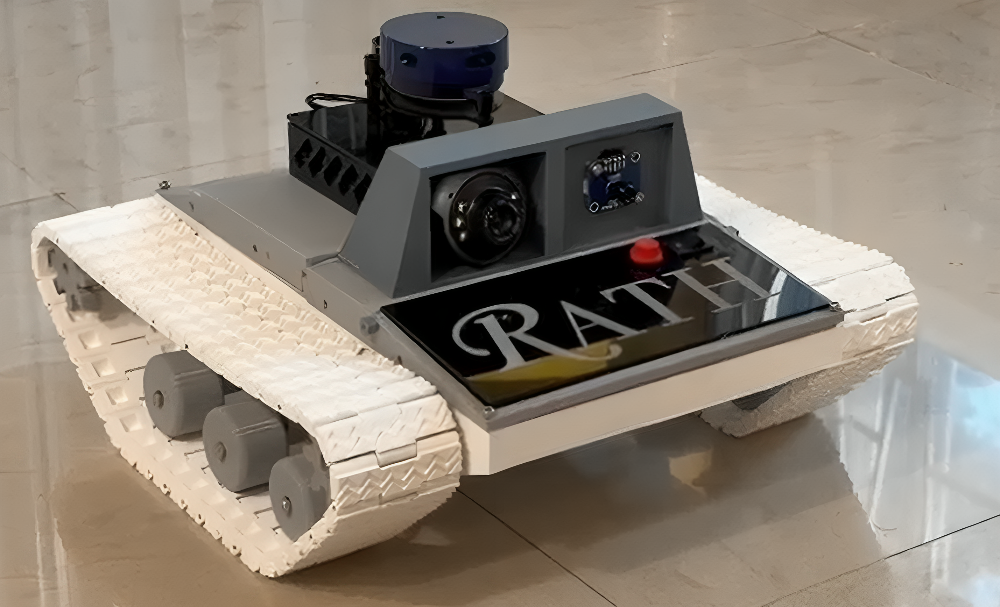
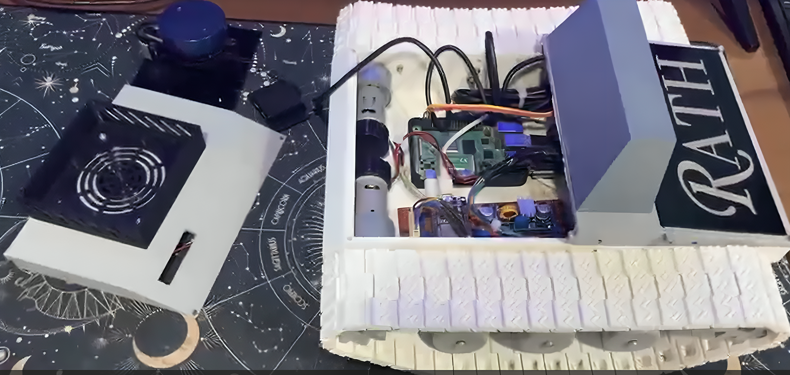
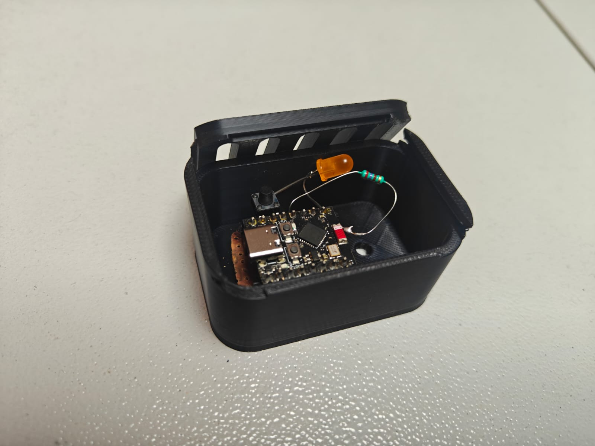
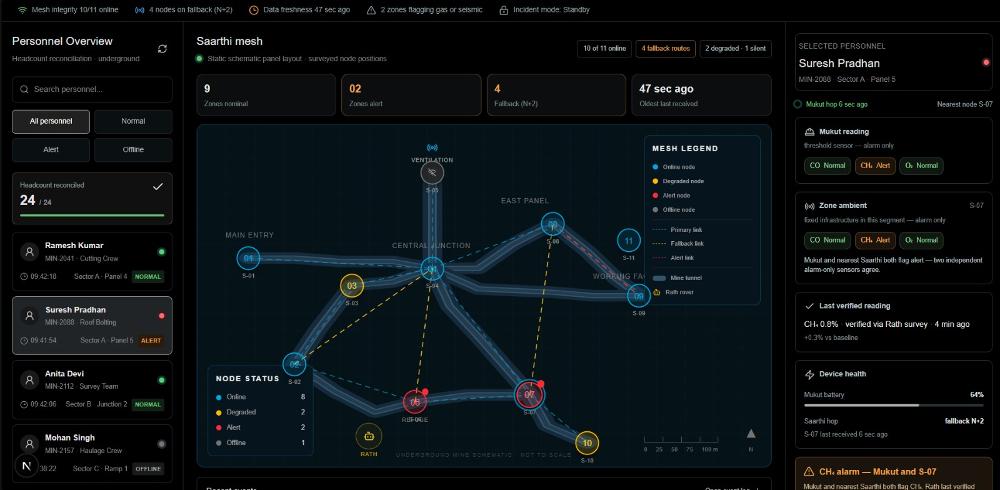
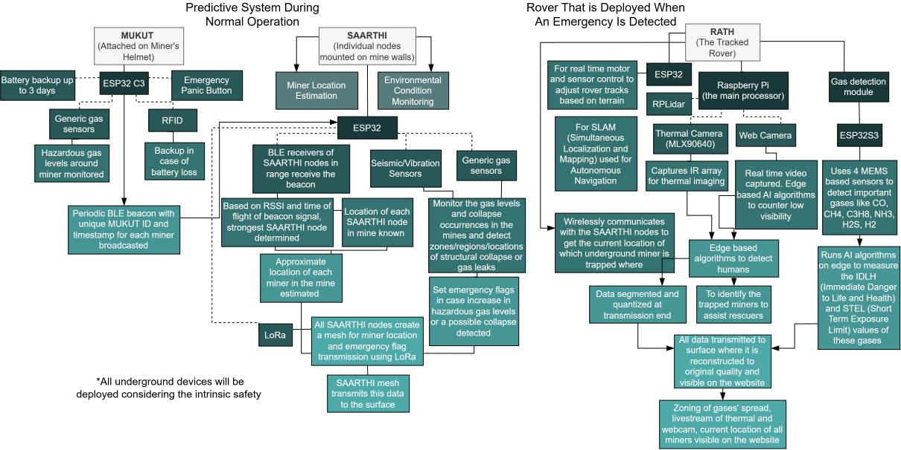

## Ready Prototype Images
<table width="100%" style="border-collapse: collapse; border: none;">
  <tr>
    <!-- Left Image and Caption -->
    <td align="left" style="border: none; width: 50%;">
       
      <small>RATH</small>
    </td>
    <!-- Right Image and Caption -->
    <td align="right" style="border: none; width: 50%;">
       
      <small>RATH- Internal View</small>
    </td>
  </tr>
</table>
<table width="100%" style="border-collapse: collapse; border: none;">
  <tr>
    <!-- Left Image and Caption -->
    <td align="left" style="border: none; width: 50%;">
       
      <small>MUKUT</small>
    </td>
    <!-- Right Image and Caption -->
    <td align="right" style="border: none; width: 50%;">
       
      <small>SAARTHI</small>
    </td>
  </tr>
</table>

 

  
   
  <small>Overview of the Website Dashboard</small>

## Problem Statement
To assist rescue teams during emergencies in underground coal mines, providing them with real time information of the underground conditions and reducing response delays.

## Solution Proposed

Underground coal mining remains one of the most hazardous industrial environments in the world, and the danger compounds sharply the moment something goes wrong. Toxic gas accumulation, flooding, tunnel or roof collapse, and near-zero visibility are everyday operational risks, but the real crisis begins after an incident: rescue teams typically have to enter an area they know almost nothing about, using safety infrastructure that was often destroyed in the same event they're responding to. TRISHUL is built around the observation that the mine already has plenty of monitoring and communication equipment, but almost all of it depends on fixed wiring and infrastructure, which means it fails at exactly the moment it's needed most, when a tunnel collapse severs it. TRISHUL's design goal is to build a system that keeps functioning after the primary infrastructure has been physically destroyed. The name reflects this directly-  like a trident, the system is only complete and effective when its three separate units work together as one weapon against the problem, rather than as three independent gadgets.

Unit One:  Mukut (the worn identity and locator unit). Mukut is a helmet-mounted module worn continuously by every miner during their shift. It serves two distinct functions that solve different problems and use different mechanisms. The first is live tracking: each Mukut unit periodically broadcasts a short low-power beacon signal using ESPNOW broadcast mode using an ESP32C3 (containing its unique ID) that nearby Sarthi nodes pick up. This periodic broadcast is deliberately low-frequency (on the order of once every few minutes) to conserve battery across a full shift, and the broadcast timing includes a small randomised jitter so that if two helmets happen to power on at nearly the same moment, they don't end up permanently transmitting in lockstep and repeatedly colliding. The second function is physical identification during actual recovery. If a miner is unconscious, or their helmet's battery has died, or the local network is down, there is no live signal to query. For this reason, Mukut also carries a passive NFC/RFID tag, which requires no onboard power at all and can be read by a rescuer's handheld reader simply by being close to it- carrying the worker's ID,, and any critical medical flags. This is a deliberate, low-power fallback layered underneath the active tracking system.

Unit Two: Sarthi (the fixed monitoring and mesh backbone). Sarthi nodes are installed at intervals along the mine's tunnels, at positions that are surveyed and recorded once during installation. They perform three jobs simultaneously. First, they listen for Mukut beacons and report what they hear to the surface, which is how miner location is estimated. To receive the Mukut beacons, they have ESP32 in receive mode for ESPNOW broadcast. Sarthi nodes do trilateration- two or three nearby nodes each report the signal strength (RSSI) at which they received the same beacon, the surface system can combine these readings to produce a rough position estimate, generally biased toward whichever node heard the signal strongest. 
Second, Sarthi continuously monitors the mine environment using onboard sensors- general-purpose gas sensors for baseline monitoring, and seismic/vibration sensors capable of detecting the ground motion associated with a roof or tunnel failure. Rather than streaming raw sensor values constantly, each node processes its readings locally and only raises a flag when values move meaningfully beyond an established baseline, thus keeping  routine network traffic small and making genuine anomalies stand out clearly at the surface dashboard. 
Third, Sarthi nodes relay all of this information- miner locations and sensor flags, hop by hop through a self-organising wireless mesh network back to a surface gateway. This mesh is designed so that no single node is a single point of failure for everything behind it: each node simply broadcasts what it knows, listens for what its neighbours are broadcasting, and forwards new information onward, using packet IDs and a hop-limit to prevent the same message being endlessly re-broadcast in loops. If a node goes offline, its neighbours simply stop hearing from it and traffic reroutes through whatever alternative path still exists, without needing to be manually reconfigured. A collapse event is inferred not from a single sensor reading in isolation, but from a correlated pattern- several adjacent Sarthi nodes going silent at once, together with a seismic spike reported by nodes still alive nearby. 
These Sarthi nodes are powered normally through the power cables that are already present in the mines. They also have an additional battery backup in case the power lines are disrupted in an event of a collapse.

Unit Three: Rath (the autonomous rescue rover). Rath is only deployed after the surface command centre confirms a likely collapse event or gas leak from the Sarthi network's combined signals. It is a tracked rover specifically chosen over wheels because tracks distribute weight and maintain traction across loose rubble and uneven collapsed terrain, which wheeled platforms handle poorly. For navigation, Rath uses LIDAR-based SLAM (simultaneous localisation and mapping), allowing it to build a live map of the collapsed area as it drives and navigate autonomously without needing a pre-existing map of the zone. 
Rath carries a dedicated multi-gas sensing unit, distinct from Sarthi's generic sensors, because at this stage the mission needs precise, gas-specific readings rather than a simple threshold flag. This unit detects CO, CH4, propane, ammonia, and H2S individually, and an onboard processor calculates standard occupational safety metrics- IDLH (Immediately Dangerous to Life or Health) and STEL (Short-Term Exposure Limit) values, directly from these readings using established formulas, so that rescue teams receive an already-interpreted hazard assessment rather than raw numbers they'd have to manually cross-reference.
Rath also carries a thermal camera and a standard visual camera; because visibility underground after a collapse is often extremely poor (dust, smoke, low light), the video and thermal streams are processed by AI-based image restoration/enhancement algorithms at the surface, to improve usability for both the human operators watching the feed and any onboard person-detection algorithms trying to automatically spot survivors in the footage, rather than relying solely on a human operator to notice something in a degraded feed.
All the measurements and visuals obtained from the Rath as well as the miner locations obtained from the Mukut and transmitted via Sarthi network would then be visible on a central dashboard at the surface, in real time.

TRISHUL proposes a resilient, layered safety and rescue architecture designed to remain operational when conventional mine infrastructure is compromised. By integrating Mukut's persistent worker identification and localisation, Sarthi's distributed environmental monitoring and self-organising communication backbone, and Rath's autonomous reconnaissance and hazard-assessment capabilities, the system establishes a continuous chain from detection and localisation to assessment and response. Its distributed architecture ensures that the failure of individual nodes or communication links does not necessarily result in the failure of the entire system, while the combination of active and passive identification, local sensor intelligence, mesh communication, autonomous mapping, multi-gas analysis, and enhanced visual and thermal perception provides redundancy across multiple stages of an emergency. Rather than attempting to replace existing mine safety infrastructure, TRISHUL is designed as a resilient layer that takes over when that infrastructure becomes unavailable. Ultimately, the system aims to reduce uncertainty during the most critical phase of a mining disaster, enabling rescue teams to understand where the incident has occurred, what hazards are present, and how the affected area can be approached before human responders are exposed to unnecessary risk.

## Technical Approach 
